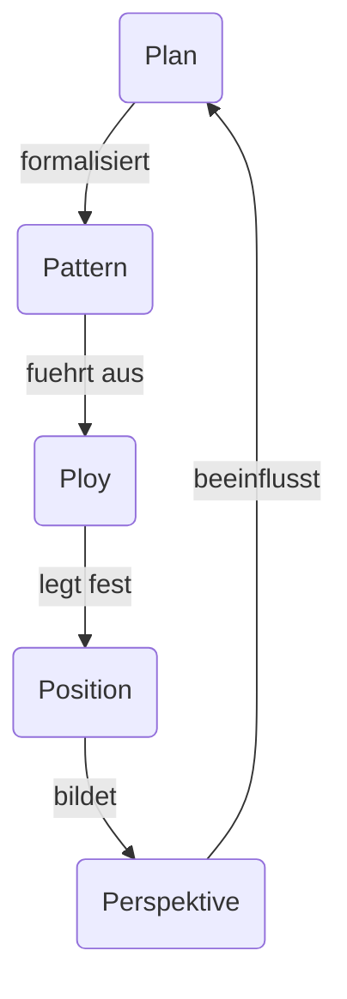
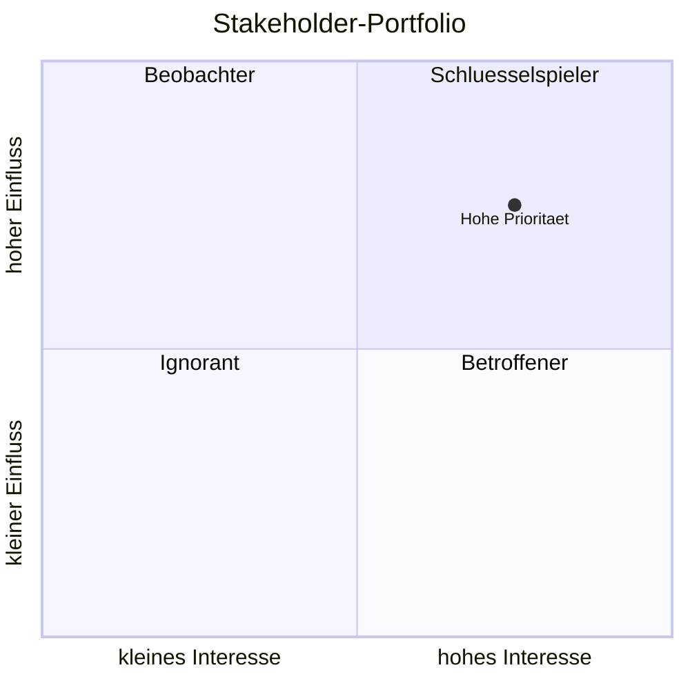

# 1. Einstieg – Kaufmann, Handelsregister, Rechtsformen

## Kaufmann (§1 HGB)

Kaufmann ist, wer ein Handelsgewerbe betreibt.

Ein Handelsgewerbe liegt vor, wenn ein Unternehmen:

- dauerhaft betrieben wird
    
- selbstständig ist
    
- Gewinnerzielungsabsicht hat
    
- einen kaufmännisch eingerichteten Geschäftsbetrieb benötigt
    

---

## Wer ist kein Kaufmann?

- Freiberufler (Arzt, Anwalt, Lehrer)
    
- Land- und Forstwirte (grundsätzlich)
    

---

## Handelsregister

Öffentliches Verzeichnis aller Kaufleute.

### HRA
Einzelkaufleute und Personengesellschaften

e.K. (eingetragener Kaufmann), OHG, KG

### HRB
Kapitalgesellschaften

GmbH, AG

---

## Rechtsformen

### Einzelunternehmen

Vorteile:

- einfache Gründung
    
- alleinige Entscheidungen
    

Nachteil:

- unbeschränkte Haftung
    

---

### GbR

- mindestens 2 Personen
    
- einfache Gründung
    
- persönliche Haftung
    

---

### OHG

- Handelsgewerbe
    
- alle Gesellschafter haften unbeschränkt
    

---

### KG

- Komplementär → unbeschränkte Haftung
    
- Kommanditist → beschränkte Haftung
    

---

### GmbH

- juristische Person
    
- Haftung auf Gesellschaftsvermögen beschränkt
    

---

### AG

- Grundkapital in Aktien
    
- Eigentümer = Aktionäre
    
- Haftung beschränkt
    

---

# 2. Materialwirtschaft

## Definition

Versorgung des Unternehmens mit Material:

> richtige Menge, richtige Qualität, richtiger Ort, richtige Zeit

---

## Materialarten

### Rohstoffe

Hauptbestandteil des Produkts

Beispiel:

Holz beim Tisch

---

### Hilfsstoffe

Nebenbestandteil

Beispiel:

Schrauben

---

### Betriebsstoffe

Für Produktion notwendig

Beispiel:

Strom, Schmieröl

---

## Bedarf

### Primärbedarf

Bedarf an Endprodukten

Beispiel:

100 Fahrräder

---

### Sekundärbedarf

Bedarf an Einzelteilen

Beispiel:

200 Reifen

---

## Bestellverfahren

### Bestellpunktverfahren

Bestellung bei Erreichen eines Mindestbestands.

---

### Bestellrhythmusverfahren

Bestellung in festen Zeitabständen.

---

## Lagerprinzipien

### FIFO

First In – First Out

Älteste Ware zuerst.

---

### LIFO

Last In – First Out

Neueste Ware zuerst.

---

# 3. Produktionswirtschaft

## Produktion

Umwandlung von Produktionsfaktoren in Güter.

---

## Produktionsfaktoren

- Arbeitskraft
    
- Betriebsmittel
    
- Werkstoffe
    

---

## Produktionsmanagement

### Planung

- Was?
    
- Wie viel?
    
- Wann?
    

---

### Organisation

Abläufe festlegen.

---

### Koordination

Abteilungen abstimmen.

---

### Kontrolle

Soll-Ist-Vergleich.

---

## Fertigungstypen

### Einzelfertigung

Ein Produkt.

Beispiel:

Hausbau

---

### Serienfertigung

Begrenzte Anzahl.

Beispiel:

Auto-Modell

---

### Massenfertigung

Unbegrenzte Menge.

Beispiel:

Schrauben

---

### Vorratsfertigung

Produktion ohne konkrete Bestellung.

---

# 4. Strategisches Management

## Definition

Langfristige Sicherung des Unternehmenserfolgs.

---

## Vision

Wo wollen wir hin?

Beispiel:

„Nachhaltigster Kopfhörerhersteller Europas werden.“

---

## Mission

Warum existieren wir?

Beispiel:

„Menschen mit hochwertigem Klang versorgen.“

---

## Leitbild

Werte und Grundsätze.

Beispiel:

Nachhaltigkeit, Qualität, Innovation.

---

# SMART-Ziele

|Buchstabe|Bedeutung|
|---|---|
|S|Spezifisch|
|M|Messbar|
|A|Aktionsorientiert / Attraktiv|
|R|Realistisch|
|T|Terminiert|

Beispiel:

> Umsatz bis Dezember um 10 % steigern.

---

# Mintzbergs 5 P

## Plan

Strategie als Plan.

---

## Ploy

Strategie als Trick.

---

## Pattern

Strategie als Muster.

---

## Position

Marktposition.

---

## Perspective

Unternehmenssichtweise.

---

# 5. Marketing I

## Marketing

Marketing ist eine kundenorientierte Unternehmensführung. Ziel ist die Erreichung absatzorientierter Unternehmensziele.

---

## Kunde vs. Konsument

### Kunde

Kauft Produkte.

### Konsument

Verbraucht Produkte.

Nicht immer dieselbe Person.

---

## B2B

Business-to-Business

Unternehmen → Unternehmen

---

## B2C

Business-to-Consumer

Unternehmen → Endkunde

---

## Entwicklungsphasen

1. Produktionsorientierung
    
2. Verkaufsorientierung
    
3. Marktorientierung
    
4. Wettbewerbsorientierung
    
5. Umfeldorientierung
    
6. Beziehungsorientierung
    
7. Netzwerkorientierung
    

---

## Kaufentscheidungsprozess

1. Ausgangssituation
    
2. Informationssuche
    
3. Alternativen prüfen
    
4. Kaufentscheidung
    
5. Nachkaufverhalten
    

---

## Einflussfaktoren Kaufverhalten

- kulturelle
    
- soziale
    
- persönliche
    
- psychologische Faktoren
    

---

# 6. Marketing II

## SWOT-Analyse

### Strengths

Stärken

Interne Vorteile

---

### Weaknesses

Schwächen

Interne Nachteile

---

### Opportunities

Chancen

Externe Möglichkeiten

---

### Threats

Risiken

Externe Gefahren

---

## Zielarten

### Unternehmensziele

- Wachstum
    
- Marktanteil
    
- Wettbewerbsfähigkeit
    

---

### Finanzielle Ziele

- Umsatz
    
- Gewinn
    
- Cashflow
    

---

### Marketingziele

- Bekanntheit
    
- Kundengewinnung
    
- Absatzsteigerung
    
- Markenimage
    

---

## Produkt-Markt-Matrix (Ansoff)

|Produkt|Markt|Strategie|
|---|---|---|
|alt|alt|Marktdurchdringung|
|alt|neu|Marktentwicklung|
|neu|alt|Produktentwicklung|
|neu|neu|Diversifikation|

---

## Marketingstrategie

### Segmentierung

Markt aufteilen:

- geografisch
    
- soziodemografisch
    
- psychografisch
    
- Kaufverhalten
    

---

### Targeting

Zielgruppe auswählen:

- undifferenziert
    
- differenziert
    
- konzentriert
    

---

### Positionierung

Abgrenzung vom Wettbewerb.

### USP

Unique Selling Proposition

Einzigartiger Verkaufsvorteil.

---

# 7. Marketing III

## Marketing-Mix (4 Ps)

### Product

Produktpolitik

---

### Price

Preispolitik

---

### Place

Distributionspolitik

---

### Promotion

Kommunikationspolitik

---

## Distribution

### Direkt

Hersteller → Kunde

---

### Indirekt

Hersteller → Großhandel → Einzelhandel → Kunde

---

## Promotion

### Above-the-Line

Klassische Werbung

- TV
    
- Radio
    
- Print
    

---

### Below-the-Line

- PR
    
- Direktmarketing
    
- Verkaufsförderung
    
- Sponsoring
    
- E-Communication
    

---

## Marktforschung

### Primärdaten

Selbst erhoben

---

### Sekundärdaten

Bereits vorhanden

---

### Desk Research

Schreibtischforschung

---

### Field Research

Feldforschung

---

### Quantitativ

Zahlen

---

### Qualitativ

Meinungen

---

# 8. Internes und Externes Rechnungswesen (nur rote X)

## Teilgebiete

### Externes Rechnungswesen

- Bilanz
    
- GuV
    
- Geschäftsbericht
    

### Internes Rechnungswesen

- Kostenrechnung
    
- Controlling
    

---

## Adressaten

### Extern

- Banken
    
- Kunden
    
- Lieferanten
    
- Staat
    
- Gesellschafter
    

### Intern

- Management
    

---

## Inhalte

### Extern

- Jahresabschluss
    
- Konzernabschluss
    

### Intern

- Kostenrechnung
    
- Budgetierung
    

---

## Funktionen

### Externes Rechnungswesen

1. Gewinnermittlung
    
2. Rechenschaft
    
3. Gläubigerschutz
    
4. Dokumentation
    

---

### Internes Rechnungswesen

#### Planung

- Investition
    
- Beschaffung
    
- Produktion
    
- Absatz
    

#### Kontrolle

- Wirtschaftlichkeit
    
- Abweichungsanalysen
    

---

# 9. Projektmanagement

## Was ist ein Projekt?
Merkmale:

- eindeutiges Ziel
    
- zeitlich begrenzt
    
- individuell
    
- komplex
    

---

## Projektmanagement

Gesamtheit aller Aufgaben zur:

1. Initiierung
    
2. Definition
    
3. Planung
    
4. Steuerung
    
5. Abschluss
    

---

## Zielhierarchie

### Projektvision

Langfristige Richtung

### Strategische Projektziele

Mittelfristige Ziele

### Operative Projektziele

Konkrete Ziele

---

## SMART-Ziele

- Spezifisch
    
- Messbar
    
- Aktionsorientiert
    
- Realistisch
    
- Terminiert
    

---

## Stakeholder

Personen mit Interesse am Projekt.

Beispiele:

- Auftraggeber
    
- Projektleiter
    
- Team
    
- Kunden
    
- Betroffene Mitarbeiter
    

---

# Die 20 wichtigsten Klausurbegriffe

1. Kaufmann
    
2. Handelsregister
    
3. Rohstoff
    
4. Primärbedarf
    
5. Bestellpunktverfahren
    
6. Produktionsplanung
    
7. Vision
    
8. Mission
    
9. Leitbild
    
10. SMART
    
11. Mintzberg 5P
    
12. Marketing
    
13. B2B
    
14. SWOT
    
15. USP
    
16. Marketing-Mix
    
17. Direktvertrieb
    
18. Marktforschung
    
19. Internes Rechnungswesen
    
20. Projektmanagement
    
