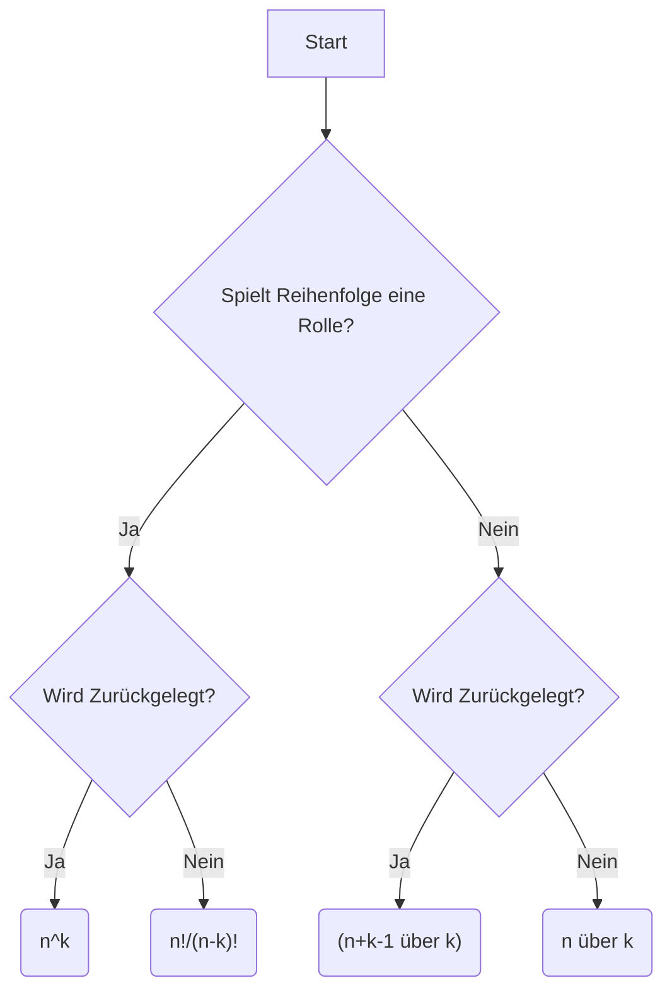

# Inhaltsverzeichnis

1. **Kombinatorik**
    - Vier Standardfälle sicher unterscheiden.
    - Entscheidungsbaum anwenden.
    - Aufgaben mit Bedingungen systematisch lösen.
2. **Zahlentheorie & Modulare Arithmetik**
    - Euklidischer und erweiterter Euklidischer Algorithmus.
    - Multiplikative Inverse.
    - Kongruenzen.
    - Euler-φ, Euler-Satz.
    - ISBN.
    - RSA.
    - Chinesischer Restsatz.
3. **Graphentheorie**
    - Euler- und Hamiltonwege.
    - DFS und BFS.
    - Spannbäume (Prim/Kruskal).
    - Graphfärbung.
    - Bipartite Graphen und Matching.
4. **Analytische Geometrie (2D)**
    - Vektoren.
    - Längen.
    - Skalarprodukt.
    - Winkel.
    - Geraden.
    - Punktprobe.
    - Punkt-Gerade-Abstand.
## Zusätzlich
Jedes Kapitel enthält:
- **Definition**
- **Erklärung**
- **Formeln**
- **Wann benutzt man sie?**
- **Schritt-für-Schritt-Vorgehen**
- **Beispiel mit vollständiger Lösung**
- **Typische Klausurfallen**
- **Merkkasten**
- **Mini-Zusammenfassung**

---

# Teil 1 – Kombinatorik

Dieser Teil orientiert sich an der Wiederholung, der Probeklausur und den Hinweisen aus der Fragestunde. Schwerpunkt ist **das Erkennen des richtigen Aufgabentyps**, denn genau das entscheidet meistens darüber, ob eine Aufgabe richtig gelöst wird.

---

## 1. Grundlagen

### Was ist Kombinatorik?

Die Kombinatorik beschäftigt sich mit der Frage:

> **"Wie viele Möglichkeiten gibt es?"**

Beispiele:

- Wie viele Passwörter gibt es?
- Wie viele Kennzeichen gibt es?
- Wie viele Flaggen kann man bilden?
- Wie viele Lottozettel gibt es?

Fast jede Klausuraufgabe lässt sich auf **vier Standardfälle** zurückführen.

---

## 2. Das Urnenmodell

Fast alle Aufgaben können als **Urnenmodell** betrachtet werden.

Man stellt sich eine Urne mit Kugeln vor.

Beispiel:

```
Urne

○ a
○ b
○ c
○ d
```

Nun zieht man mehrere Kugeln.

Jetzt muss man sich **zwei Fragen stellen.**

---

## 3. Die zwei wichtigsten Fragen

### Frage 1

#### Spielt die Reihenfolge eine Rolle?

Ja:

```
ABC

ist etwas anderes als

BAC
```

Beispiele:

- Passwort
- PIN
- Sitzordnung
- Kennzeichen

---

Nein:

```
{A,B,C}

=

{B,C,A}
```

Beispiele:

- Lotto
- Team auswählen
- Ausschuss wählen

---

### Frage 2

#### Wird zurückgelegt?

Mit Zurücklegen

Nach jedem Ziehen kommt die Kugel wieder zurück.

```
1
↓

Urne

↓

1 ist wieder drin
```

Man darf also mehrfach dieselbe Kugel ziehen.

---

Ohne Zurücklegen

Gezogene Kugeln verschwinden.

```
1 gezogen

↓

1 weg
```

Man kann dieselbe Kugel nicht erneut ziehen.

---

## 4. Die vier Standardfälle

Merke dir diese Tabelle unbedingt.

| Reihenfolge | Zurücklegen | Name                          | Formel              |
| ----------- | ----------- | ----------------------------- | ------------------- |
| ja          | ja          | Variation mit Wiederholung    | $n^k$               |
| ja          | nein        | Variation ohne Wiederholung   | $\frac{n!}{(n-k)!}$ |
| nein        | nein        | Kombination ohne Wiederholung | $\binom nk$         |
| nein        | ja          | Kombination mit Wiederholung  | $\binom{n+k-1}{k}$  |

**Diese Tabelle solltest du auswendig können.**

---

## 5. Entscheidungsbaum

Bei jeder Aufgabe gehst du genau so vor:



Fast jede Aufgabe der Probeklausur passt hier hinein.

---

## 6. Fakultät

Definition

### $n!=1\cdot2\cdot3\cdot\ldots\cdot n$

Beispiele

### $5!=120$

### $6!=720$

### $8!=40320$

---

Wichtig

## $0!=1$

---

## 7. Binomialkoeffizient

Definition

## $\binom nk = \frac{n!}{k!(n-k)!}$

Bedeutung:

> Wie viele Möglichkeiten gibt es,  
> **k Elemente aus n auszuwählen?**

---

Beispiel

10 Personen

3 sollen gewählt werden

## $\binom{10}{3}=120$

---

Merke

Der Binomialkoeffizient bedeutet immer:

**Auswahl ohne Reihenfolge.**

---

## 8. Variation mit Wiederholung

### Bedingungen

✔ Reihenfolge wichtig

✔ Zurücklegen erlaubt

---

Formel

## $n^k$

---

#### Beispiel 1

PIN mit 4 Ziffern

Jede Stelle:

10 Möglichkeiten

```
0000
0001
...

9999
```

### $10^4=10000$

---

#### Beispiel 2

Norwegisches Kennzeichen

2 Buchstaben

4 Ziffern

Ohne Einschränkungen:

$26^2\cdot10^4$

Da **0000 verboten** ist, muss dieser Fall noch abgezogen werden. Genau so lautet die erste Aufgabe der Probeklausur.

---

## Typische Aufgaben

- PIN
- Passwort
- Würfeln
- Münzwürfe
- Kennzeichen

---

## 9. Variation ohne Wiederholung

### Bedingungen

✔ Reihenfolge wichtig

✔ Kein Zurücklegen

---

Formel

## $\frac{n!}{(n-k)!}$

---

#### Beispiel

Flagge

5 Farben

3 Plätze

Keine Farbe doppelt

```
Rot

Blau

Gelb
```

Anders als

```
Gelb

Blau

Rot
```

Reihenfolge zählt.

## $\frac{5!}{2!}=60$

Genau diese Aufgabe erscheint in der Probeklausur.

---

Typische Aufgaben

- Sitzordnung
- Flaggen
- Podestplätze
- Passwörter ohne Wiederholung

---

## 10. Kombination ohne Wiederholung

### Bedingungen

✔ Reihenfolge egal

✔ Kein Zurücklegen

---

Formel

## $\binom nk$

---

Beispiel

49 Lottozahlen

6 werden gezogen

## $\binom{49}{6}$

---

Typische Aufgaben

- Lotto
    
- Ausschuss
    
- Team
    
- Jury
    

---

## 11. Kombination mit Wiederholung

### Bedingungen

✔ Reihenfolge egal

✔ Zurücklegen

---

Formel

## $\binom{n+k-1}{k}$

---

#### Beispiel

5 Eissorten

3 Kugeln

Man darf dieselbe Sorte mehrfach wählen.

```
Schoko

Schoko

Vanille
```

ist erlaubt.

## $\binom{5+3-1}{3}=\binom73=35$

Dieses Beispiel entspricht auch der Wiederholung.

---

## 12. Bitstrings

Sehr beliebte Klausuraufgaben.

---

Beispiel

Wie viele Bitstrings der Länge 6 besitzen genau zwei Einsen?

```
101000

010100

100010
```

---

Lösung

Die Positionen der Einsen werden gewählt.

## $\binom62=15$

---

Beispiel

Genau drei Nullen?

Dann wählt man

3 Positionen

## $\binom63$

---

Merke

Bei Bitstrings wählt man fast immer **Positionen**.

---

## 13. Stichproben

Beispiel

10 PCs

3 werden ausgewählt

## $\binom{10}{3}$

---

Sind zusätzlich

2 defekt,

rechnet man meist

## $\binom22 \cdot \binom81$

also:

- defekte auswählen
- funktionierende auswählen

Dieses Schema taucht auch in der Wiederholung auf.

---

## 14. Aufgaben mit Bedingungen

Diese Aufgaben sind etwas schwieriger.

Beispiel

> Eine sechsstellige Zahl besitzt genau zwei Nullen.

Vorgehen:

**Schritt 1**

Positionen der beiden Nullen wählen
## $\binom62$

---

**Schritt 2**

Restliche Stellen füllen

Jede Stelle:

9 Möglichkeiten

(erste Stelle darf zusätzlich nicht 0 sein – auf solche Einschränkungen achten)

Dann multipliziert man beide Ergebnisse.

Genau dieses Prinzip steckt hinter Aufgabe 3 der Probeklausur.

---

## 15. Häufige Klausurfallen

## Falle 1

Reihenfolge vergessen

```
ABC

und

BAC
```

Sind **nicht** immer gleich.

---

## Falle 2

Zurücklegen vergessen

Mehrfach dieselbe Farbe erlaubt?

Mehrfach dieselbe Zahl erlaubt?

Immer prüfen.

---

## Falle 3

Falsche Formel

Nicht auswendig raten.

Immer erst den Entscheidungsbaum benutzen.

---

## Falle 4

Sonderfälle

Beispiel:

```
0000 verboten
```

Dann:

alle Möglichkeiten berechnen

minus

verbotene Möglichkeiten.

---

## Falle 5

"Genau"

Wenn dort steht

> genau zwei Nullen

Dann dürfen es **nicht drei** sein.

---

## 16. Strategie für jede Kombinatorik-Aufgabe

1. **Was wird gezählt?**
2. **Reihenfolge wichtig?**
3. **Mit oder ohne Zurücklegen?**
4. **Welche Formel passt?**
5. **Gibt es Einschränkungen?** (z. B. erste Stelle ≠ 0, "0000 verboten", genau zwei Nullen)
6. **Falls mehrere Bedingungen gelten:** Aufgabe in Teilprobleme zerlegen und Ergebnisse multiplizieren.

---

## 17. Merkkasten (für die Prüfung)

### Die vier Formeln

## $\boxed{n^k}$

→ Reihenfolge + Zurücklegen

---

## $\boxed{\frac{n!}{(n-k)!}}$

→ Reihenfolge + kein Zurücklegen

---

## $\boxed{\binom nk}$

→ Keine Reihenfolge + kein Zurücklegen

---

## $\boxed{\binom{n+k-1}{k}}$

→ Keine Reihenfolge + Zurücklegen

---
# Teil 2 – Zahlentheorie & Modulare Arithmetik

Dieser Teil deckt den größten Themenblock eurer Klausur ab. Die Probeklausur enthält hierzu Aufgaben zu **multiplikativer Inversen**, **ISBN**, **RSA** und **Kongruenzen**, während die Wiederholung zusätzlich **Euler-φ**, **Euler-Satz**, **erweiterten Euklid** und den **Chinesischen Restsatz** behandelt.

---

# 1. Teilbarkeit

## Definition

Eine Zahl **a** teilt eine Zahl **b**, wenn beim Teilen kein Rest entsteht.

Schreibweise:

## $a \mid b$

Das bedeutet:

## $b=a\cdot k$

für ein ganzzahliges (k).

---

## Beispiele

## $3|12$

denn
## $12=3\cdot4$

---

## $5\nmid18$

weil

## $18=5\cdot3+3$

---

## Teilbarkeitsregeln

|Zahl|Regel|
|---|---|
|2|letzte Ziffer gerade|
|3|Quersumme durch 3 teilbar|
|4|letzte zwei Ziffern durch 4 teilbar|
|5|Endziffer 0 oder 5|
|6|durch 2 **und** 3 teilbar|
|8|letzte drei Ziffern durch 8 teilbar|
|9|Quersumme durch 9 teilbar|
|10|Endziffer 0|

Diese Regeln werden besonders bei ISBN-Aufgaben genutzt.

---

# 2. Primzahlen

Eine Primzahl besitzt **genau zwei positive Teiler**:

- 1
- sich selbst

Beispiele:
## $2,3,5,7,11,13,17,\dots$

---

## Keine Primzahlen

## $1$

ist **keine** Primzahl.

Das wird häufig verwechselt.

---

# 3. Primfaktorzerlegung

Jede natürliche Zahl lässt sich eindeutig als Produkt von Primzahlen schreiben.

Beispiel

## $450$

## $450=2\cdot3^2\cdot5^2$

Diese Zerlegung benötigt man für:

- φ-Funktion
- ggT
- kgV

---

# 4. Größter gemeinsamer Teiler (ggT)

Definition

Der ggT zweier Zahlen ist der größte gemeinsame Teiler.

Beispiel
## $18=2\cdot3^2$
## $30=2\cdot3\cdot5$

Gemeinsam:
## $2\cdot3=6$

also
## $ggT(18,30)=6$

---

# 5. Euklidischer Algorithmus

Der schnellste Weg, den ggT zu berechnen.

---

## Algorithmus

Immer:
## $a=q\cdot b+r$

Dann
## $ggT(a,b)=ggT(b,r)$

Bis
## $r=0$

---

## Beispiel
## $ggT(23,10)$
### $23 = 2·10 + 3$
### $10 = 3·3 + 1$
### $3 = 3·1 + 0$

↓
## $ggT=1$

---

## Klausurtipp

Nicht im Kopf rechnen.

Schreibe jede Division sauber untereinander.

---

# 6. Erweiterter Euklid

Damit berechnet man

- Bézout-Koeffizienten
- multiplikative Inverse

---

## Ziel

Man sucht
## $x,y$

mit
## $ax+by=ggT(a,b)$

---

## Vorgehen

1. normalen Euklid durchführen
2. von unten einsetzen
3. nach oben zurückrechnen

---

## Beispiel

Berechne
## $7^{-1}\mod23$

Euklid:
### $23 = 3·7 +2$
### $7 = 3·2 +1$
### $2 = 2·1 +0$

Jetzt zurück:
### $1=7-3\cdot2$
### $2=23-3\cdot7$

Einsetzen:
### $1=7-3(23-3\cdot7)$
### $=10\cdot7-3\cdot23$

Damit
### $10\cdot7\equiv1\pmod{23}$

also
### $7^{-1}=10$

Genau solche kurzen Beispiele sind laut Fragestunde zu erwarten.

---

# 7. Bézout-Identität

Es gilt
### $ax+by=ggT(a,b)$

wenn
### $x,y\in\mathbb Z$

---

## Wichtig

Sind
### $ggT(a,b)=1$

dann heißen die Zahlen

**teilerfremd**.

Nur dann existiert ein multiplikatives Inverses modulo.

---

# 8. Modulare Arithmetik

Man betrachtet nur den Rest einer Division.

---

Beispiel
### $17\mod5=2$

denn
### $17=3\cdot5+2$

---

## Kongruenz

Schreibweise
### $a\equiv b\pmod m$

Bedeutung:

a und b besitzen denselben Rest.

---

Beispiel
### $17\equiv2\pmod5$

---

# 9. Rechengesetze

Addition

## $(a+b)\mod m = ((a\mod m)+(b\mod m))\mod m$

---

Multiplikation

## $(ab)\mod m = ((a\mod m)\cdot(b\mod m))\mod m$

---

## Beispiel
## $66\cdot34 \mod7$
### $66 ≡ 3$
### $34 ≡ 6$

↓
### $3\cdot6=18$
### $18 \mod7=4$

---

# 10. Multiplikative Inverse

Gesucht:
### $a^{-1}$

mit
### $a\cdot a^{-1}\equiv1\pmod m$

---

## Existenz

Nur wenn
### $ggT(a,m)=1$

---

## Beispiel
### $3^{-1}\mod7$

Da
### $3\cdot5=15$

und
### $15\equiv1\mod7$

ist
### $3^{-1}=5$

---

# 11. Lineare Kongruenzen

Aufgabe
### $ax\equiv b\pmod m$

---

## Vorgehen

### Fall 1
## $ggT(a,m)=1$

↓
Inverse berechnen
↓
beide Seiten mit Inverser multiplizieren.

---

Beispiel
### $3x\equiv4\pmod7$
Inverse:
### $3^{-1}=5$

↓
### $x=5\cdot4=20  \equiv6$

---

### Fall 2
### $ggT(a,m)=d>1$

Wenn
### $d\nmid b$

↓

keine Lösung.

---

Wenn
### $d|b$

↓

mehrere Lösungen.

---

# 12. Euler-φ-Funktion

Definition
### $\varphi(n)$

=

Anzahl aller Zahlen
### $1,\dots,n$

die zu n teilerfremd sind.

---

## Primzahl

Ist
### $p$

prim
### $\boxed{\varphi(p)=p-1}$

---

## Produkt zweier Primzahlen

### $\boxed{\varphi(pq)=(p-1)(q-1)}$

---

## Allgemein

Bei
### $n=p_1^{a_1}\cdots p_k^{a_k}$

gilt
## $\boxed{\varphi(n)=n\left(1-\frac1{p_1}\right)\cdots\left(1-\frac1{p_k}\right)}$  


---

## Beispiele
### $\varphi(7)=6$

---
### $\varphi(15)=8$

---
### $\varphi(35)=24$

---

# 13. Satz von Euler

Falls

[  
ggT(a,m)=1  
]

gilt

[  
\boxed{  
a^{\varphi(m)}  
\equiv  
1  
\pmod m  
}  
]

---

## Wofür?

Große Potenzen berechnen.

---

Beispiel

[  
3^{100}\mod7  
]

Da

[  
\varphi(7)=6  
]

und

[  
100=16\cdot6+4  
]

folgt

# [  
3^{100}

(3^6)^{16}\cdot3^4  
]

[  
3^6\equiv1  
]

↓

nur noch

[  
3^4  
]

berechnen.

---

# 14. Chinesischer Restsatz

Aufgabe

Gegeben

[  
x\equiv1\mod3  
]

[  
x\equiv2\mod5  
]

[  
x\equiv4\mod7  
]

---

Voraussetzung

Alle Moduli müssen paarweise teilerfremd sein.

---

## Klausur

Ihr müsst vor allem

- Schema anwenden
    
- sauber rechnen
    

Die Wiederholung enthält den vollständigen Algorithmus.

---

# 15. ISBN-10

Eine ISBN besitzt

10 Stellen.

Die letzte Stelle

=

Prüfziffer.

---

## Regel

[  
10a_1  
+  
9a_2  
+  
...  
+  
a_{10}  
]

muss durch

11

teilbar sein.

---

## Klausur

Laut Fragestunde wahrscheinlich nur:

- Prüfziffer berechnen
    
- fehlende Ziffer bestimmen
    

Nicht:

- Tippfehler erkennen
    
- Vertauschungen untersuchen
    

---

# 16. RSA

RSA besteht immer aus denselben Schritten.

---

## Schritt 1

Gegeben

[  
p,q  
]

---

## Schritt 2

Berechne

[  
n=pq  
]

---

## Schritt 3

Berechne

# [  
\varphi(n)

(p-1)(q-1)  
]

---

## Schritt 4

Gegeben

[  
e  
]

mit

[  
ggT(e,\varphi(n))=1  
]

---

## Schritt 5

Berechne

[  
d=e^{-1}\mod\varphi(n)  
]

---

## Öffentlicher Schlüssel

[  
(n,e)  
]

---

## Privater Schlüssel

[  
d  
]

---

## Verschlüsselung

[  
c=m^e\mod n  
]

---

## Entschlüsselung

[  
m=c^d\mod n  
]

---

## Genau dieses Schema wird in der Probeklausur verwendet.

---

# 17. Typische Klausurfallen

### ❌ Inverse existiert immer

Nein.

Nur wenn

[  
ggT(a,m)=1  
]

---

### ❌ φ falsch berechnet

Nicht

[  
pq-1  
]

sondern

[  
(p-1)(q-1)  
]

---

### ❌ Euklid abbrechen

Erst stoppen, wenn Rest = 0.

---

### ❌ RSA

Nicht vergessen:

zuerst φ berechnen,

dann d.

---

### ❌ Modulo zu spät anwenden

Reduziere Zwischenergebnisse möglichst früh modulo (m), um große Zahlen zu vermeiden.

---

# 18. Merkkasten (für die Prüfung)

## Die wichtigsten Formeln

### ggT

Euklidischer Algorithmus

---

### Bézout

[  
ax+by=ggT(a,b)  
]

---

### Inverse

Existiert genau dann, wenn

[  
ggT(a,m)=1  
]

---

### Euler-φ

[  
\varphi(p)=p-1  
]

[  
\varphi(pq)=(p-1)(q-1)  
]

---

### Euler

[  
a^{\varphi(m)}  
\equiv1  
\pmod m  
]

---

### RSA

[  
n=pq  
]

[  
\varphi=(p-1)(q-1)  
]

[  
d=e^{-1}  
]

[  
c=m^e\mod n  
]

[  
m=c^d\mod n  
]

---

## Prüfungsstrategie

Wenn du diesen Themenblock lernst, solltest du besonders folgende Aufgabentypen sicher beherrschen:

1. **Erweiterten Euklid** (kurze Rechnungen)
    
2. **Multiplikative Inverse**
    
3. **ISBN-Prüfziffer**
    
4. **RSA Schritt für Schritt**
    
5. **Lineare Kongruenzen**
    
6. **Chinesischen Restsatz**
    
7. **Große Potenzen modulo** mithilfe von Euler
    

Diese Themen decken nahezu den gesamten Bereich der Probeklausur und der Wiederholung ab.

---
# Teil 3 – Graphentheorie

Die Graphentheorie macht einen großen Teil der Klausur aus. In der Probeklausur kommen **Euler/Hamilton**, **Graphfärbung**, **Tiefensuche (DFS)** und **vollständiges Matching** vor. In der Wiederholung werden zusätzlich **Bäume**, **Breitensuche (BFS)**, **Prim** und **Kruskal** behandelt.

---

# 1. Grundlagen

## Was ist ein Graph?

Ein Graph besteht aus:

- **Knoten (Vertices)**
    
- **Kanten (Edges)**
    

Beispiel:

```
A ----- B
|       |
|       |
C ----- D
```

Hier gilt:

- Knoten = A, B, C, D
    
- Kanten = Verbindungen
    

---

## Schreibweise

Ein Graph wird meist geschrieben als

[  
G=(V,E)  
]

mit

- (V) = Knotenmenge
    
- (E) = Kantenmenge
    

---

# 2. Grad eines Knotens

Der **Grad** ist die Anzahl der Kanten, die an einem Knoten liegen.

Beispiel

```
A ----- B
 \     /
   \ /
    C
```

Grad(A)=2

Grad(B)=2

Grad(C)=2

---

Merke:

**Schleifen zählen doppelt.**

---

# 3. Adjazenz

Zwei Knoten heißen **adjazent**, wenn sie direkt verbunden sind.

Beispiel

```
A ----- B
```

A und B sind adjazent.

---

# 4. Adjazenzliste

Beispiel

```
A : B C

B : A D

C : A D

D : B C
```

Diese Darstellung wird in eurer Probeklausur verwendet.

---

# 5. Adjazenzmatrix

```
    A B C D

A   0 1 1 0

B   1 0 0 1

C   1 0 0 1

D   0 1 1 0
```

1 = Kante vorhanden

0 = keine Kante

---

# 6. Wege

## Weg

Folge von Knoten.

```
A

↓

B

↓

C

↓

D
```

---

## Einfacher Weg

Kein Knoten wird doppelt besucht.

---

## Kreis

Start = Ende.

```
A

↓

B

↓

C

↓

A
```

---

# 7. Zusammenhang

Ein Graph heißt **zusammenhängend**, wenn jeder Knoten von jedem anderen erreichbar ist.

---

Nicht zusammenhängend:

```
A ----- B

C ----- D
```

Es existieren zwei Zusammenhangskomponenten.

---

# 8. Eulerweg

Definition

Ein Eulerweg benutzt

**jede Kante genau einmal.**

Knoten dürfen mehrfach besucht werden.

---

## Wann existiert ein Eulerweg?

Der Graph muss zusammenhängend sein.

Außerdem:

**Genau 0 oder 2 Knoten besitzen ungeraden Grad.**

---

## Eulerkreis

Ein Eulerkreis ist ein Eulerweg,

bei dem

Start = Ende.

---

Existiert genau dann, wenn

**alle Knoten geraden Grad besitzen.**

---

### Merksatz

|Ungerade Grade|Ergebnis|
|---|---|
|0|Eulerkreis|
|2|Eulerweg|
|>2|kein Eulerweg|

---

## Beispiel

```
A ---- B
|      |
|      |
D ---- C
```

Alle Grade =2

↓

Eulerkreis vorhanden.

---

# 9. Hamiltonweg

Definition

Ein Hamiltonweg besucht

**jeden Knoten genau einmal.**

---

Hamiltonkreis

Alle Knoten genau einmal

zurück zum Start.

---

### Unterschied

Euler:

> jede **Kante**

Hamilton:

> jeder **Knoten**

Das wird in Klausuren sehr häufig verwechselt.

---

# 10. Isomorphie

Zwei Graphen sind isomorph,

wenn sie eigentlich gleich aussehen,

nur anders beschriftet wurden.

---

Prüfen:

- gleiche Knotenzahl
    
- gleiche Kantenzahl
    
- gleiche Gradfolge
    

Erst dann lohnt sich eine genauere Zuordnung.

---

# 11. Baum

Definition

Ein Baum ist

- zusammenhängend
    
- kreisfrei
    

---

Eigenschaft

Hat ein Baum

[  
n  
]

Knoten,

dann besitzt er

[  
n-1  
]

Kanten.

---

Beispiel

```
      A

     / \

    B   C

   /

  D
```

4 Knoten

3 Kanten

---

# 12. Spannbaum (Gerüst)

Ein Spannbaum

- verbindet alle Knoten
    
- enthält keinen Kreis
    

---

In der Probeklausur wird ein Gerüst mit DFS bestimmt.

---

# 13. Tiefensuche (DFS)

DFS = **Depth First Search**

Idee:

Immer möglichst tief gehen.

---

Beispiel

```
A

↓

B

↓

D

↑

↓

C

↓

E
```

---

### Datenstruktur

DFS benutzt einen

**Stack**

(bzw. Rekursion).

---

## Vorgehen

1. Startknoten markieren
    
2. ersten unbesuchten Nachbarn besuchen
    
3. wiederholen
    
4. Sackgasse?
    
5. zurückgehen
    

---

# 14. Breitensuche (BFS)

BFS = Breadth First Search

---

Idee

Erst alle Nachbarn,

dann Nachbarn der Nachbarn.

---

```
A

↓

B C

↓

D E F
```

---

### Datenstruktur

Queue

(FIFO)

---

### Unterschied

DFS

↓

Tiefe

---

BFS

↓

Breite

---

# 15. Minimaler Spannbaum

Gesucht

Alle Knoten verbinden

mit minimalem Gesamtgewicht.

---

# 16. Prim-Algorithmus

Idee

Man startet

bei einem beliebigen Knoten.

Dann:

Immer

**die billigste Kante**

zum nächsten Knoten wählen.

---

Merksatz

Prim wächst

**von innen nach außen.**

---

# 17. Kruskal-Algorithmus

Idee

Alle Kanten

nach Gewicht sortieren.

Dann:

Immer

die billigste nehmen,

wenn dadurch

kein Kreis entsteht.

---

Merksatz

Kruskal denkt

**in Kanten**

Prim denkt

**in Knoten**

---

# Unterschied Prim/Kruskal

|Prim|Kruskal|
|---|---|
|startet bei einem Knoten|startet mit allen Kanten|
|wächst zusammenhängend|verbindet Teilbäume|
|betrachtet Nachbarkanten|betrachtet alle Kanten|

---

# 18. Graphfärbung

Ziel

Möglichst wenige Farben,

damit benachbarte Knoten

verschiedene Farben besitzen.

---

Chromatische Zahl

[  
\chi(G)  
]

=

kleinste Anzahl benötigter Farben.

---

In der Probeklausur

muss zusätzlich

der Graph

zur Landkarte gezeichnet werden.

---

# 19. Bipartite Graphen

Ein Graph ist bipartit,

wenn seine Knoten

in zwei Mengen

geteilt werden können,

sodass

innerhalb einer Menge

keine Kanten existieren.

---

Beispiel

```
Links

A

B

C

|

|

|

Rechts

1

2

3
```

---

## Wichtig

Ein Graph ist genau dann bipartit,

wenn er

**keinen Kreis ungerader Länge**

besitzt.

---

# 20. Matching

Matching

=

Menge von Kanten,

bei denen

kein Knoten doppelt verwendet wird.

---

Beispiel

```
A ---- 1

B ---- 2

C ---- 3
```

Alle Knoten benutzt.

↓

Vollständiges Matching.

---

Dieses Thema kommt direkt in der Probeklausur vor.

---

# 21. Typische Klausurfallen

### ❌ Euler und Hamilton vertauschen

Euler

↓

Kanten

Hamilton

↓

Knoten

---

### ❌ DFS und BFS verwechseln

DFS

↓

Stack

↓

Tiefe

---

BFS

↓

Queue

↓

Breite

---

### ❌ Prim und Kruskal

Prim

↓

Knoten

---

Kruskal

↓

Kanten

---

### ❌ Baum

Ein Baum besitzt

immer

[  
n-1  
]

Kanten.

---

### ❌ Eulerbedingungen

Nicht raten.

Immer

Grade zählen.

---

# 22. Vorgehensweise in der Klausur

## Euler

1. Grad jedes Knotens bestimmen.
    
2. Anzahl der Knoten mit ungeradem Grad zählen.
    
3. Mit der Tabelle entscheiden:
    
    - 0 → Eulerkreis
        
    - 2 → Eulerweg
        
    - mehr als 2 → keiner
        

---

## Hamilton

Es gibt keine einfache Formel. Suche einen Weg/Kreis, der **jeden Knoten genau einmal** besucht. Falls keiner existiert, begründe dies anhand der Struktur des Graphen.

---

## DFS

1. Startknoten wählen (oft vorgegeben).
    
2. Immer den ersten noch unbesuchten Nachbarn besuchen.
    
3. Erst bei einer Sackgasse zurückgehen.
    
4. Das entstehende Gerüst einzeichnen oder angeben.
    

---

## Prim

1. Bei einem Startknoten beginnen.
    
2. Immer die günstigste Kante zum nächsten **noch nicht besuchten** Knoten wählen.
    
3. Keine Kreise erzeugen.
    

---

## Kruskal

1. Alle Kanten nach Gewicht sortieren.
    
2. Kleinste Kante wählen.
    
3. Nur hinzufügen, wenn kein Kreis entsteht.
    
4. Wiederholen, bis alle Knoten verbunden sind.
    

---

# 23. Merkkasten (für die Prüfung)

## Euler

- **Kanten** genau einmal
    
- 0 ungerade Grade → Eulerkreis
    
- 2 ungerade Grade → Eulerweg
    

---

## Hamilton

- **Knoten** genau einmal
    

---

## Baum

- zusammenhängend
    
- kreisfrei
    
- (n-1) Kanten
    

---

## DFS

- Tiefe
    
- Stack
    
- Gerüst
    

---

## BFS

- Breite
    
- Queue
    

---

## Prim

- Start bei einem Knoten
    
- günstigste Nachbarkante
    

---

## Kruskal

- Kanten sortieren
    
- günstigste kreisfreie Kante
    

---

## Bipartit

- zwei Knotenmengen
    
- **kein ungerader Kreis**
    

---

## Matching

- kein Knoten darf in zwei Matching-Kanten vorkommen
    
- vollständiges Matching: alle Knoten einer Seite werden zugeordnet
    

---

## Prüfungsfokus

Basierend auf der Probeklausur und den Wiederholungsunterlagen würde ich für Graphentheorie diese Reihenfolge empfehlen:

1. ⭐⭐⭐⭐⭐ Euler- und Hamiltonwege
    
2. ⭐⭐⭐⭐⭐ DFS (Gerüst aus Adjazenzliste)
    
3. ⭐⭐⭐⭐⭐ Matching in bipartiten Graphen
    
4. ⭐⭐⭐⭐ Graphfärbung
    
5. ⭐⭐⭐ Prim und Kruskal
    
6. ⭐⭐ Isomorphie und Adjazenzmatrix (Grundlagen)
    

Wenn du diese Themen sicher beherrschst, solltest du den Graphentheorie-Teil der Klausur sehr gut abdecken.

---
# Teil 4 – Analytische Geometrie (2D)

> **Wichtig:** Laut den Hinweisen aus der Fragestunde sollen in der Klausur **nur zwei Aufgaben aus der Analytischen Geometrie** vorkommen (ca. **17 Punkte**) und **nur in 2D**. Deshalb konzentriert sich dieser Lernzettel auf die Grundlagen, die dafür benötigt werden.

---

# 1. Vektoren

## Definition

Ein Vektor beschreibt eine **Richtung und Länge**.

Beispiel

[  
\vec v=  
\begin{pmatrix}  
3\  
4  
\end{pmatrix}  
]

---

## Darstellung

Ein Vektor besitzt

- Richtung
    
- Länge
    

aber **keinen festen Ort**.

---

## Vektor zwischen zwei Punkten

Gegeben

[  
A(x_1,y_1)  
]

[  
B(x_2,y_2)  
]

Dann gilt

# [  
\boxed{  
\overrightarrow{AB}

\begin{pmatrix}  
x_2-x_1\  
y_2-y_1  
\end{pmatrix}  
}  
]

---

## Beispiel

A(2|3)

B(7|8)

# [  
\overrightarrow{AB}

\begin{pmatrix}  
5\  
5  
\end{pmatrix}  
]

---

# 2. Vektorlänge

Die Länge eines Vektors berechnet sich mit dem Satz des Pythagoras.

# [  
\boxed{  
|\vec v|

\sqrt{x^2+y^2}  
}  
]

---

## Beispiel

[  
\vec v=  
\begin{pmatrix}  
3\  
4  
\end{pmatrix}  
]

# [  
|\vec v|

5  
]

Genau diese Aufgabe kommt in der Probeklausur vor.

---

# 3. Skalarprodukt

Definition

# [  
\boxed{  
\vec a\cdot\vec b

a_xb_x+a_yb_y  
}  
]

---

## Beispiel

# [  
\begin{pmatrix}  
2\  
3  
\end{pmatrix}  
\cdot  
\begin{pmatrix}  
4\  
5  
\end{pmatrix}

# 2\cdot4+3\cdot5

23  
]

---

# 4. Winkel zwischen zwei Vektoren

Formel

# [  
\boxed{  
\cos\alpha

\frac{\vec a\cdot\vec b}  
{|\vec a||\vec b|}  
}  
]

---

## Vorgehen

1. Skalarprodukt berechnen
    
2. Beide Längen berechnen
    
3. In die Formel einsetzen
    
4. arccos berechnen
    

---

## Beispiel

[  
\vec a=  
\begin{pmatrix}  
1\  
0  
\end{pmatrix}  
]

[  
\vec b=  
\begin{pmatrix}  
0\  
1  
\end{pmatrix}  
]

Skalarprodukt

=

0

↓

[  
\alpha=90^\circ  
]

---

# 5. Orthogonalität

Zwei Vektoren stehen senkrecht aufeinander,

wenn

[  
\boxed{  
\vec a\cdot\vec b=0  
}  
]

---

## Beispiel

[  
\begin{pmatrix}  
2\  
1  
\end{pmatrix}  
,  
\begin{pmatrix}  
1\  
-2  
\end{pmatrix}  
]

[  
2\cdot1+1\cdot(-2)=0  
]

↓

orthogonal.

---

# 6. Geradengleichung

Parameterform

# [  
\boxed{  
\vec x

\vec p  
+t\vec r  
}  
]

---

Dabei

[  
\vec p  
]

=

Stützvektor

(Startpunkt)

---

[  
\vec r  
]

=

Richtungsvektor

---

t

=

Parameter.

---

## Beispiel

# [  
\vec x

\begin{pmatrix}  
1\  
2  
\end{pmatrix}  
+t  
\begin{pmatrix}  
3\  
-1  
\end{pmatrix}  
]

Genau diese Form wird in der Probeklausur verwendet.

---

# 7. Punktprobe

Frage

Liegt

P

auf der Geraden?

---

## Vorgehen

1. Punkt einsetzen.
    
2. Zwei Gleichungen erhalten.
    
3. Ergibt sich dasselbe (t)?
    
    - Ja → Punkt liegt auf der Geraden.
        
    - Nein → Punkt liegt nicht auf der Geraden.
        

---

## Beispiel

Gerade

# [  
\vec x

\begin{pmatrix}  
1\  
2  
\end{pmatrix}  
+t  
\begin{pmatrix}  
3\  
-1  
\end{pmatrix}  
]

P(7|0)

---

x

[  
1+3t=7  
]

↓

t=2

---

y

[  
2-2=0  
]

↓

passt.

---

# 8. Lage zweier Geraden

## Parallel

Richtungsvektoren sind Vielfache.

---

## Identisch

Parallel

ein Punkt liegt auf beiden Geraden.

---

## Schneidend

Es existiert genau eine Lösung.

---

# 9. Abstand zweier Punkte

Formel

# [  
\boxed{  
d

\sqrt{(x_2-x_1)^2+(y_2-y_1)^2}  
}  
]

---

# 10. Abstand Punkt–Gerade

Gegeben

Punkt

Q

und Gerade

g.

---

In der Probeklausur soll dieser Abstand berechnet werden.

---

### Verfahren (mit Lotfußpunkt)

1. Gerade parametrisieren.
    
2. Senkrechte Bedingung aufstellen:  
    [  
    (\overrightarrow{SQ})\cdot\vec r=0  
    ]  
    wobei (S) ein Punkt auf der Geraden ist.
    
3. Parameter (t) berechnen.
    
4. Lotfußpunkt bestimmen.
    
5. Abstand zwischen Lotfußpunkt und (Q) berechnen.
    

---

# 11. Parallelität

Geraden sind parallel,

wenn

[  
\boxed{  
\vec r_1=\lambda\vec r_2  
}  
]

für ein

[  
\lambda  
]

existiert.

---

# 12. Typische Aufgaben

## Aufgabe 1

Vektorlänge

↓

Pythagoras.

---

## Aufgabe 2

Winkel

↓

Skalarprodukt.

---

## Aufgabe 3

Punktprobe

↓

Parameter einsetzen.

---

## Aufgabe 4

Abstand

↓

Lotfußpunkt bestimmen.

---

# 13. Typische Klausurfallen

### ❌ Länge vergessen

Immer

[  
\sqrt{x^2+y^2}  
]

---

### ❌ Falsches Skalarprodukt

Nicht

[  
x+y  
]

sondern

[  
x_1x_2+y_1y_2  
]

---

### ❌ Punktprobe

Beide Koordinaten müssen

denselben Parameter liefern.

---

### ❌ Winkel

Nicht den Kosinus

als Endergebnis angeben.

Zum Schluss

[  
\arccos  
]

berechnen (wenn der Winkel gefragt ist).

---

### ❌ Parallel

Nicht nur "ähnlich aussehen".

Die Richtungsvektoren müssen echte Vielfache sein.

---

# 14. Merkkasten (für die Prüfung)

## Vektor

# [  
\boxed{  
\overrightarrow{AB}

\begin{pmatrix}  
x_2-x_1\  
y_2-y_1  
\end{pmatrix}  
}  
]

---

## Länge

# [  
\boxed{  
|\vec v|

\sqrt{x^2+y^2}  
}  
]

---

## Skalarprodukt

# [  
\boxed{  
\vec a\cdot\vec b

a_xb_x+a_yb_y  
}  
]

---

## Winkel

# [  
\boxed{  
\cos\alpha

\frac{\vec a\cdot\vec b}  
{|\vec a||\vec b|}  
}  
]

---

## Orthogonal

[  
\boxed{  
\vec a\cdot\vec b=0  
}  
]

---

## Gerade

# [  
\boxed{  
\vec x

\vec p+t\vec r  
}  
]

---

## Parallel

[  
\boxed{  
\vec r_1=\lambda\vec r_2  
}  
]

---